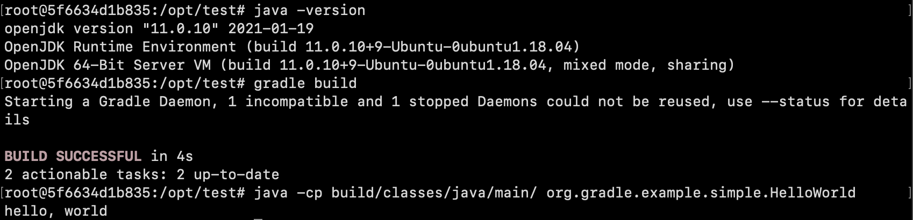

### Introduction

A basic setup for running a java environment inside a docker container, 
so you don't need to change your local machine's dev environment.

To install docker, see https://docs.docker.com/get-docker/ 

### Usage

To build the image (named `cs206_image_myname`), run 
```bash
$ docker build --no-cache -t cs206_image_myname .
```

To launch a shell with this image, run `docker run`
```bash
$ docker run -it cs206_image_myname
```

From here, you can check the java version, and build+run the test code.
```bash
$ java -version
$ gradle build
$ java -cp build/classes/java/main/ org.gradle.example.simple.HelloWorld
```


